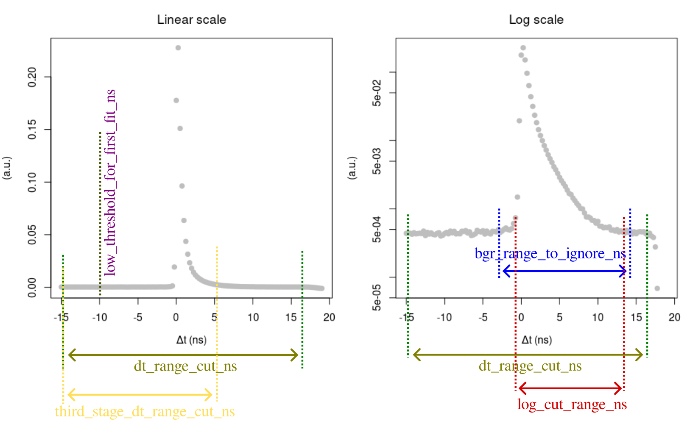

# Examples

Here, a brief description how to execute the exemplary fitting is given.

## Parameters

### _Ps lifetime spectrum parameters_

In a JSON file (see ```/params_json```), the first major block is ```"dt_histogram_params"```, which sets the basic initial parameters and ranges for multi-stage Levenberg-Marquardt (LM) fitting.

Those parameters are as follows refer to the below image for more:

-- ```"tau_dir_ns"``` : mean lifetime of direct annihilations (in ns)

-- ```"tau_pps_ns"``` : mean lifetime of para-positronium

-- ```"dt_range_cut_ns"``` : general time delay range where LM will be applied

-- ```"bgr_range_to_ignore_ns"``` : range to ignore in assessing the background (leaving only histogram "tails")

-- ```"log_cut_range_ns"``` : time delay range for the second stage  in logarithmic scale

-- ```"int_threshold_for_log_to_drop_au"``` : a threshold to drop histogram points below it (helps for sparse data)

-- ```"calc_bgr_from_full_span"``` : if true, ignores ```"dt_range_cut_ns"``` in background estimation and uses all time delay range available

-- ```"low_threshold_for_first_fit_ns"``` : raises the lower range for the first (linear) fit (ignored if null)

-- ```"third_stage_dt_range_cut_ns"``` : time delay range for the optional third stage (ignored if null)

-- ```"reduce_bgr_for_randoms"``` : if true, the lower range of 95% C.I. for background is subtracted from histogram (helps a little for data with many randoms)



