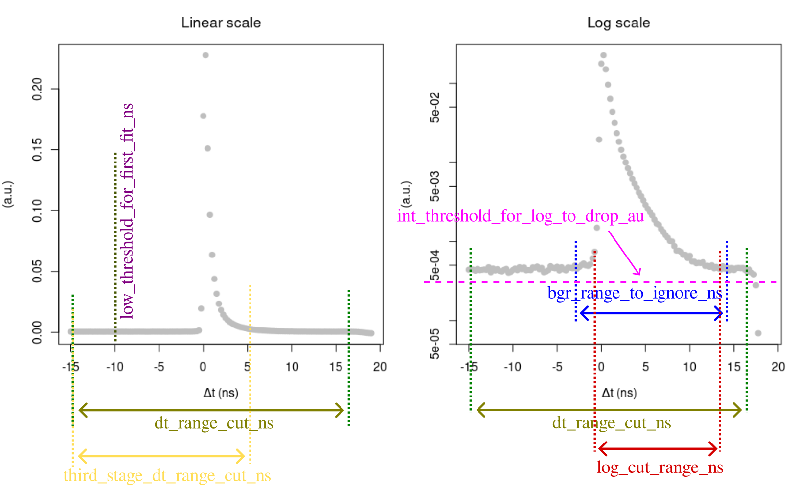

# Parameters

The description below refers to the parameters given in a JSON file.

### _Ps lifetime spectrum parameters_

The first major block is ```"dt_histogram_params"```, which sets the basic initial parameters and ranges for multi-stage Levenberg-Marquardt (LM) fitting.

Those parameters are as follows (refer to the below image for more):

-- ```"tau_dir_ns"``` : mean lifetime of direct annihilations (in ns)

-- ```"tau_pps_ns"``` : mean lifetime of para-positronium (in ns)

-- ```"dt_range_cut_ns"``` : general time delay range where LM will be applied

-- ```"bgr_range_to_ignore_ns"``` : range to ignore in assessing the background (leaving only histogram "tails")

-- ```"log_cut_range_ns"``` : time delay range for the second stage  in logarithmic scale

-- ```"int_threshold_for_log_to_drop_au"``` : a threshold to drop histogram points below it (useful for sparse data)

-- ```"calc_bgr_from_full_span"``` : if true, ignores ```"dt_range_cut_ns"``` in background estimation and uses all time delay range available

-- ```"low_threshold_for_first_fit_ns"``` : raises the lower range for the first (linear) fit (ignored if null)

-- ```"third_stage_dt_range_cut_ns"``` : time delay range for the optional third stage (ignored if null)

-- ```"reduce_bgr_for_randoms"``` : if true, the lower range of 95% C.I. for background is subtracted from histogram (helps a little for data with many randoms)



### _Parameters for initial guesses_

The next block ```"ini_guess_params"``` sets how the initial guesses are generated for the LM minimisation applied to a Ps lifetime spectrum. If not clarified, every fitting parameter is generated as uniformly distributed within the given range, e.g. a lifetime ```tau_dir = runif(tau_dir_range_ns[1], tau_dir_range_ns[2])``` (indexation in ```R``` starts from 1, not 0). Note that all initial intensities for Ps decay componens are randomly generated based on ```"i_dir_range_au"```.

-- ```"n_guesses"``` : no. of random initial guesses of fitting parameters

-- ```"seed"``` : an integer used to create reproducible results

-- ```"i_dir_range_au"``` : (2-element vector) a range for random guesses of intensities for direct annihilations

-- ```"preserve_frac_for_ints"``` : (for 3-component model only) if true, fixes intensity ratios at I_dir : I_pPs : I_oPs = 60% : 10% : 30%

-- ```"tau_dir_range_ns"``` : (2-element vector) a range for ```tau_dir``` guesses (direct annihilations)

-- ```"tau_ops1_range_ns"``` :  (2-element vector) a range for ```tau_oPs``` guesses (oPs decay)

-- ```"tau_ops2_range_ns"``` : (2-element vector) a range for an additional o-Ps component with lifetime ```tau_oPs_2``` (to be implementend in the future)

-- ```"gauss_range_ns"``` : (2-element vector) a range for Gaussian parameters (the standard deviation ```sigma``` and the mean ```mu```)

-- ```"positivity_constr_error"``` : a vector [mean, sd] used to generate positivity constraint error slightly below zero -- at ```10^rnorm(n_guesses, mean, sd)``` (see ```"no_lower_bounds"``` below)

-- ```"dt_max_range_for_fast_comp_lrnorm_ns"```: a vector [meanlog, sdlog] used to generate random upper limits below max of ```dt_range_cut_ns```, for the first (linear) LM fit as ```rlnorm(n_guesses, meanlog, sdlog)``` (typically 2-5 ns). This is made to exclude long "tail" from o-Ps, since we focus only at acquiring Gaussian parameters and (for 2-component) fast decay lifetime ```tau_fast``` (`fast` merges `dir` and `pPs`).

-- ```"symmetric_mu"``` : if true, initialises Gaussian ```mu``` symmetrically around zero as ```runif(-gauss_range_ns[2], gauss_range_ns[2])```, otherwise in a range ```gauss_range_ns``` (same as ```sigma```)

-- ```"no_lower_bounds"``` : if true, randomly generates ```TRUE``` or ```FALSE``` across all guesses. Then, for each true value -- the lower bound in fitting is ```-Inf```, while for false -- the corresponding ```positivity_constr_error``` with a negative sign. Setting this parameter true renders all lower bounds ```-Inf```.

### _Levenberg-Marquardt fitting parameters_

The final block is ```lma_params``` -- a set of options for the multi-threaded LM minimisation.

The first several parameters set the limitations that the fitted outcomes should fulfil. If not - they are rejected from the fitted candidates.

-- ```"sigma_rng_ns"``` : (2-element vector) a range where the expected Gaussian standard deviation should fall to

-- ```"tau_rng_ns"``` : (2-element vector) a range for lifetime regarding all decay components (from the fastest to the slowest)

-- ```"min_frac_taus"``` : a minimal fraction between the slowest fitted lifetime and the shortest, e.g. ```tau_oPs / tau_dir```. The p-Ps component is ignored, because its lifetime is fixed

-- ```"ints_frac_range"```: (2-element vector, if no fixed ratio between intensities is set) the allowed range for intensity fraction between the fastest and the slowest fitted component (ignoring p-Ps), i.e. ```I_dir / I_oPs``` or ```I_fast / I_oPs```

-- ```"min_int_pps"``` : normalised (in 0-1 scale) minimal intensity of p-Ps component

The next object, ```fit_control```, embraces maximum LM iteration number (```n_iter_max```), the termination criterion / tolerance level (```x_tol```) and number of digits after decimal point in the result (```round_precision```).

The final sub-block object is related to kernel density estimation (KDE) ```kde_params``` applied to the solution space of the first (linear) LM fit -- ```sd, mu``` or ```sd, mu, tau_fast```:

-- ```"drop_outliers_by_median"``` : if true, calculates median, if false -- mean for KDE, then drops outliers outside +/- 3.5 x standard deviation

-- ```"max_axis_length_2d"``` : max no. of points across the largest dimension in KDE (2D version)

-- ```"max_axis_length_3d"``` : max no. of points across the largest dimension in KDE (3D version)

-- ```"max_axis_length_4d"``` : max no. of points across the largest dimension in KDE (4D version)

-- ```"min_n_solutions"```: minimal number of converged points in multi-threaded LM, required for KDE
